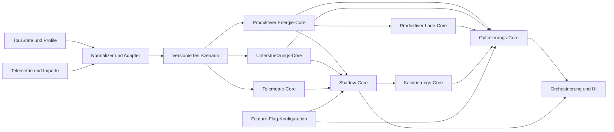

# Fachkonzept BikeTripHub Intelligence

- Stand: 2026-08-03
- Status: verbindliche Planungsgrundlage fuer die Pakete 20 bis 32
- Konzeptabschnitt: `INT-00`
- Branch: `codex/biketriphub-intelligence-concept`
- Basis: `private` nach Merge von PR #69 (`41354ac670c8d415cc459b5fe35761da02384f74`)

## 1. Ziel und Geltungsbereich

BikeTripHub Intelligence erweitert den stabilen Tourenplaner um nachvollziehbare Empfehlungen, Simulationen und persoenliche Kalibrierung. Die neuen Funktionen werden als eigenstaendige, deterministische Module innerhalb des modularen Monolithen aufgebaut.

Das Konzept legt verbindlich fest:

- mathematische und physikalische Grundannahmen,
- Grenzen zwischen produktivem Energie-/Ladekern und experimentellen Modellen,
- Datenquellen, Einheiten, Versionierung und Qualitaetskennzeichen,
- Schnittstellen und JSON-Vertraege,
- Telemetrie-, Shadow-, Kalibrierungs- und Feature-Flag-Verfahren,
- Validierungs- und Freigaberegeln,
- Abhaengigkeiten und Akzeptanzkriterien der Pakete 20 bis 32.

Die konkreten Vertragsentwuerfe stehen in [BIKETRIPHUB_INTELLIGENCE_CONTRACTS.md](BIKETRIPHUB_INTELLIGENCE_CONTRACTS.md).

## 2. Nicht Bestandteil dieses Konzeptabschnitts

Dieser Abschnitt veraendert keine produktive Rechenlogik und keine sichtbare Planerfunktion. Insbesondere werden nicht umgesetzt:

- ein neues Unterstuetzungsmodell,
- Telemetrieimport oder Telemetrieauswertung,
- persoenliche Kalibrierung,
- automatische Optimierung,
- neue Datenbanktabellen,
- neue externe Online-Abhaengigkeiten,
- Tags oder Releases.

Die vorhandenen Modelle `biketriphub-energy-v2` und `biketriphub-charging-v1` bleiben die produktive Referenz.

## 3. Leitprinzipien

1. **Stabiler Produktivpfad:** Experimentelle Ergebnisse ersetzen niemals still den produktiven Energie- oder Ladeplan.
2. **Determinismus:** Identische normalisierte Eingaben und dieselbe Modellversion ergeben bitweise gleich serialisierbare fachliche Ergebnisse innerhalb der dokumentierten Rundungsregeln.
3. **Reine Rechenkerne:** Core-Module kennen weder React noch Browser-Speicher, Datenbank, Netzwerk, Systemzeit oder Zufall.
4. **Versionierte Vertraege:** Persistierte oder exportierte Daten tragen Schema- und Modellversionen. Migrationen sind explizit und getestet.
5. **Eine Routengrundlage:** Energie, Unterstuetzung, Telemetrie und Optimierung beziehen sich auf dieselbe geordnete Segmentfolge des TourState.
6. **Belegbare Daten:** Quelle, Messart und Datenqualitaet werden mitgefuehrt. Fehlende Werte werden nicht erfunden.
7. **Sichere Voreinstellung:** Neue Intelligence-Funktionen sind standardmaessig deaktiviert oder rein informativ.
8. **Keine automatische Selbstveraenderung:** Kalibrierung erzeugt einen Vorschlag. Ein Profil wird nur nach expliziter Bestaetigung geaendert.
9. **Erklaerbarkeit:** Jede Empfehlung nennt Eingaben, Modellversion, wesentliche Teilbeitraege, Grenzen und Qualitaet.
10. **Keine Garantiebehauptung:** Reichweite und Unterstuetzung bleiben Planungshilfen, keine Zusage fuer reale Fahrbarkeit oder Gesundheit.

## 4. Ausgangsbasis

Der aktuelle Produktivstand stellt bereits bereit:

- ein zentrales `RiderBikeProfile` in Schema-Version 1,
- den segmentweisen Energie-Core `biketriphub-energy-v2`,
- persoenliche Referenzreichweiten-Kalibrierung fuer den flachen Grundverbrauch,
- einen getrennten physikalischen Steigungszuschlag ohne Rekuperation,
- den Lade-Core `biketriphub-charging-v1`,
- versionierten TourState mit Ladepunkten und manuellen Ladehalten.

Diese Schnittstellen werden zunaechst ueber Adapter eingebunden. Intelligence-Pakete duerfen die produktiven Typen nicht direkt erweitern, solange keine eigene Migration und Abwaertskompatibilitaet dokumentiert sind.

## 5. Zielarchitektur



Die Module bleiben im modularen Monolithen. Eine spaetere Ordnerstruktur kann so aussehen:

```text
src/lib/intelligence/
|-- contracts/
|-- adapters/
|-- assistance/
|-- telemetry/
|-- shadow/
|-- calibration/
|-- optimization/
`-- feature-flags/
```

### Modulgrenzen

| Modul | Verantwortung | Darf nicht |
| --- | --- | --- |
| Energie-Core | Produktive Energieprognose je Segment/Etappe | von experimentellen Modellen abhaengen |
| Lade-Core | Produktive Ladebedarfs- und Ladehaltplanung | Route oder Etappen still veraendern |
| Unterstuetzungs-Core | kontinuierliche, erklaerbare Unterstuetzung empfehlen | Profil oder Produktivplan schreiben |
| Telemetrie-Core | Messdaten normalisieren, segmentieren und Soll/Ist ableiten | Rohdaten ueberschreiben |
| Shadow-Core | produktive und experimentelle Ergebnisse vergleichen | experimentelles Ergebnis produktiv uebernehmen |
| Kalibrierungs-Core | pruefbare Kalibrierungskandidaten aus Fahrten bestimmen | Kandidaten automatisch aktivieren |
| Optimierungs-Core | Varianten unter Zielen und Grenzen vergleichen | nicht belegte Eingaben erfinden |
| Orchestrierung/UI | Module verbinden, Status und Erklaerungen anzeigen | Fachformeln duplizieren |

## 6. Determinismus- und Numerikvertrag

Ein Core-Aufruf ist deterministisch, wenn folgende Bedingungen gelten:

- kein Zugriff auf `Date.now()`, Zufall, Netzwerk, Locale oder ungeordneten persistenten Zustand,
- alle Eingaben werden vor der Berechnung validiert und auf SI-basierte Einheiten normalisiert,
- Segmentreihenfolge ist durch `startDistanceM`, danach stabile ID eindeutig,
- Summen werden in Segmentreihenfolge gebildet,
- interne Berechnung nutzt unverkuerzte JavaScript-Zahlen; Rundung erfolgt erst an der Ergebnisgrenze,
- nicht endliche Werte, negative Distanzen und ungueltige Zeitfolgen werden abgewiesen,
- Modell- und Schema-Version gehoeren zum Ergebnis,
- ein kanonischer Eingabe-Hash wird aus kanonisch serialisierten, fachlich relevanten Eingaben gebildet.

Fachwerte werden fuer Export und Vergleich einheitlich gerundet:

- Energie: 0,1 Wh,
- Leistung: 0,1 W,
- Distanz: 1 m,
- Hoehe: 0,1 m,
- Zeit: 1 s,
- Geschwindigkeit: 0,01 m/s,
- Prozentwerte: 0,1 Prozentpunkte.

Die UI darf abweichend lesefreundlich runden, muss aber den Core-Wert unveraendert speichern.

## 7. Physikalisches Grundmodell

Das Intelligence-Modell verwendet die vorhandene Energieprognose als Produktivbasis. Fuer experimentelle Simulationen gelten pro Segment mindestens folgende Groessen:

- Gesamtmasse `m` in kg,
- Segmentlaenge `d` in m,
- Hoehendifferenz `deltaH` in m,
- Fahrzeit `t` in s,
- Geschwindigkeit `v = d / t` in m/s,
- Steigungswinkel `theta = atan2(deltaH, d_horizontal)`,
- Rollwiderstandsbeiwert `Crr`,
- aerodynamische Stirnflaeche `CdA` in m2,
- Luftdichte `rho` in kg/m3,
- Erdbeschleunigung `g = 9,80665 m/s2`.

Kraefte am Rad:

```text
F_roll  = Crr * m * g * cos(theta)
F_grade = m * g * sin(theta)
F_air   = 0,5 * rho * CdA * v_rel^2
P_wheel = max(0, (F_roll + F_grade + F_air) * v)
E_wheel = P_wheel * t / 3600
```

Ohne belegte Winddaten gilt `v_rel = v`. Negative Gesamtleistung erzeugt ohne ausdruecklich aktiviertes und hardwareseitig belegtes Rekuperationsmodell keine Akkuenergie.

### Referenzreichweite und Hoehenmeter

Die in Paket 18 festgelegte Trennung bleibt verbindlich:

```text
Akkuenergie = kalibrierter flacher Grundverbrauch
            + physikalischer Steigungszuschlag
            - begrenzte Gefaelleentlastung
```

- `referenceRangeKm` bezieht sich auf die aktuell konfigurierte Gesamtakkuanzahl bis 0 %.
- Der daraus abgeleitete Verbrauch kalibriert nur den flachen Grundverbrauch.
- Positive Hoehenmeter werden separat bewertet und duerfen durch die Flachkalibrierung nicht neutralisiert werden.
- Gefaelle darf den Bedarf mindern, aber ohne Rekuperationsnachweis keinen negativen Akkuverbrauch erzeugen.
- Die gewuenschte Reserve wird nach der technischen Reichweite separat bewertet.

## 8. Kontinuierliches Unterstuetzungsmodell

Die interne Unterstuetzung wird nicht als Herstellername, sondern als kontinuierliches dimensionsloses Verhaeltnis `u` beschrieben:

```text
u = P_motor_mechanisch / P_fahrer_mechanisch
```

Beispiel: `u = 1,0` entspricht rechnerisch 100 % Motorunterstuetzung relativ zum Fahreranteil. Die zulaessige Spanne stammt aus dem validierten Profil und wird durch Motorleistung und weitere belegte Grenzen gekappt.

Fuer eine angeforderte Radleistung `P_required` ergibt sich vor Leistungsgrenzen:

```text
P_rider_target = P_required / (1 + u)
P_motor_target = P_required - P_rider_target
```

Danach werden Fahrerleistungsgrenze, Motorleistungsgrenze und Wirkungsgrad angewendet. Kann die Zielgeschwindigkeit unter den Grenzen nicht gehalten werden, wird dies ausgewiesen; der Core erfindet keine zusaetzliche Leistung.

Die Empfehlung waehlt deterministisch den kleinsten Unterstuetzungswert, der zugleich:

- die Zielgeschwindigkeit soweit physikalisch moeglich erfuellt,
- die zulaessige persoenliche Fahrerleistung einhaelt,
- die Abschnittsdauer beruecksichtigt,
- die Zielreserve am Planungshorizont nicht unterschreitet.

Konflikte werden durch eine feste Prioritaet geloest:

1. ungueltige oder physikalisch unmoegliche Zustaende kennzeichnen,
2. Motor- und Profilgrenzen einhalten,
3. Reservegrenze schuetzen,
4. persoenliche Dauerleistungsgrenze einhalten,
5. Zielgeschwindigkeit annaehern,
6. niedrigste dafuer ausreichende Unterstuetzung waehlen.

Herstellermodi sind nur eine Darstellungszuordnung. Ein Mapping enthaelt Name, Unterstuetzungsbereich, Quelle und Qualitaet. Ohne belegtes Mapping werden ausschliesslich generische Bereiche wie Eco, Tour, Sport oder Turbo angezeigt. `Auto` wird nicht als fester Prozentwert behauptet.

## 9. Telemetrie

### Rohdaten und normalisierte Daten

Rohimporte bleiben unveraendert und erhalten Quelle, Importzeit, Dateipruefsumme und Formatkennung. Der Telemetrie-Core erzeugt daraus eine neue, versionierte Normalform. Ein normalisierter Messpunkt kann enthalten:

- Zeitstempel in UTC,
- WGS84-Koordinate,
- kumulierte Distanz,
- Hoehe und Steigung,
- Geschwindigkeit,
- Fahrer- und Motorleistung,
- Akkustand in Wh und/oder Prozent,
- Trittfrequenz,
- Temperatur,
- GPS- und Sensorqualitaet.

Fehlende Messwerte bleiben `null` oder fehlen gemaess Schema. `0` ist ein Messwert und kein Ersatz fuer unbekannt.

### Segmentierung

Die Segmentierung ist deterministisch und versioniert. Grenzen koennen aus fixer Distanz, Zeitfenster, Routenpunkten oder Steigungswechseln entstehen. Fuer Soll/Ist-Vergleiche muessen mindestens dieselben Start-/Enddistanzen und dasselbe Hoehenbezugsverfahren verwendet werden.

Ausreisserkorrekturen, Glaettung und Hoehenkorrekturen werden als eigene Transformationen mit Parametern und Qualitaetsauswirkung dokumentiert. Die Rohdaten bleiben erhalten.

## 10. Shadow Mode

Der Shadow-Core fuehrt Produktiv- und Experimentmodell mit demselben normalisierten Szenario aus und erzeugt nur einen Vergleich:

- produktive Modellversion und Ergebnis,
- experimentelle Modellversion und Ergebnis,
- absolute und relative Abweichungen,
- Eingabe-Hash,
- Qualitaet und Warnungen beider Modelle.

Shadow-Ergebnisse duerfen weder den TourState noch das Profil, Ladehalte oder Etappen veraendern. Eine Uebernahme in den Produktivpfad erfordert einen eigenen Architekturentscheid, Regressionstests, Raspberry-Pi-Abnahme, fachliche Abnahme und ausdrueckliche Merge-Freigabe.

## 11. Persoenliche Kalibrierung

Kalibrierung verarbeitet nur Fahrten, deren Profil, Akkuaufbau, Unterstuetzungsdaten und Messqualitaet ausreichend bekannt sind. Das Verfahren ist reproduzierbar:

1. Fahrten validieren und unpassende Datensaetze mit Gruenden ausschliessen.
2. Vergleichbare Segmente normalisieren.
3. Je Fahrt Kandidaten fuer Referenzverbrauch, Fahrerleistung und Unterstuetzungsfaktor bestimmen.
4. Kandidaten robust, zunaechst per Median beziehungsweise qualitaetsgewichteter Medianbildung, zusammenfassen.
5. Harte fachliche Grenzen anwenden und Begrenzungen sichtbar ausweisen.
6. Ergebnis gegen zurueckgehaltene Fahrten validieren.
7. Kalibrierungskandidat mit Konfidenz, Stichprobe, Modellversion und Abweichungen ausgeben.
8. Profil erst nach ausdruecklicher Benutzerbestaetigung aktualisieren.

Eine einzelne Fahrt darf keine automatische persoenliche Kalibrierung ausloesen. Die Mindestanzahl und Qualitaetsgrenzen werden in Paket 26 anhand realer Testdaten festgelegt und versioniert.

## 12. Feature Flags

Paket 20 liefert nur einen reinen, nicht produktiv aktivierten Core. Paket 25 ergaenzt die vollstaendige Flag-Infrastruktur. Der Vertragsentwurf gilt jedoch ab dem ersten Intelligence-Modul.

Jedes Flag besitzt:

- stabilen Schluessel,
- Schema-Version,
- Standardwert `false`,
- Geltungsbereich (`development`, `shadow`, `user-preview`, `production`),
- optionale Abhaengigkeiten,
- Begruendung und verantwortliches Modul,
- einen Kill-Switch ohne Datenmigration.

Geplante Schluessel:

```text
intelligence.assistance.continuous
intelligence.telemetry.analysis
intelligence.shadow.energy
intelligence.calibration.personal
intelligence.factor.temperature
intelligence.factor.surface
intelligence.factor.wind
intelligence.rider.adaptive-power
intelligence.regeneration
intelligence.optimization.stages
```

Ein Flag veraendert keine gespeicherten Fachwerte. Persistiert werden Konfiguration und die Modellversion, mit der ein Ergebnis erzeugt wurde. Unbekannte Flags werden als deaktiviert behandelt.

## 13. Datenquellen, Nachweise und Datenschutz

Zulaessige Quellen sind:

- explizite Benutzereingaben,
- versionierte BikeTripHub-Profile,
- Herstellerunterlagen mit Quellenangabe,
- exportierte Daten einer Fahrrad-App,
- lokale Telemetriedateien,
- spaeter gesondert freigegebene Provider.

Ein Bild oder Screenshot ist keine direkt vertrauenswuerdige strukturierte Quelle. OCR darf in einem spaeteren, separat beauftragten Importpaket nur Importkandidaten erzeugen; jeder Wert muss vor Speicherung bestaetigt und mit Quelle sowie Qualitaet gekennzeichnet werden.

Telemetrie kann Standort-, Leistungs- und Gesundheitsnaehe besitzen. Deshalb gelten mindestens:

- expliziter Import durch den Benutzer,
- keine automatische externe Uebertragung,
- lokale Verarbeitung als Voreinstellung,
- transparente Loesch- und Exportmoeglichkeit,
- keine geheimen API-Schluessel im Frontend,
- dokumentierte Aufbewahrung und Zweckbindung vor einer Serverpersistenz.

## 14. Qualitaets- und Validierungsstrategie

Jedes Core-Paket benoetigt:

- Schema- und Grenzwerttests,
- Unit-Tests fuer Formeln und Teilbeitraege,
- Golden-Master-Faelle mit festem Input und Output,
- Determinismus-Wiederholungstests,
- Invariantentests,
- Adapter- und Migrationstests,
- Save/Load- und kanonische Exporttests, falls Daten persistiert werden,
- Integrationsvergleich mit dem produktiven Energie-/Ladekern,
- dokumentierte manuelle Raspberry-Pi-Pruefung.

Verbindliche Invarianten:

- mehr positive Hoehenmeter erhoehen bei sonst identischen Bedingungen den Bedarf,
- mehr Gesamtgewicht erhoeht Roll- und Steigungsbedarf,
- hoehere Motorunterstuetzung senkt nicht still den Batteriebedarf,
- ohne Rekuperation entsteht keine negative Akkuenergie,
- Summen der Segmentbeitraege entsprechen der Etappen- und Tourensumme innerhalb der Rundungstoleranz,
- schlechte oder unvollstaendige Daten senken die Qualitaet statt Genauigkeit vorzutaueschen,
- deaktivierte Flags liefern exakt den bisherigen Produktivpfad.

Fuer Modellvergleiche werden Fehlermaße wie absoluter Fehler in Wh, relativer Fehler, Reserve-Klassifikation und Fehler an der ersten kritischen Stelle getrennt ausgewiesen. Ein einzelner mittlerer Prozentwert reicht fuer eine Freigabe nicht aus.

## 15. Freigabe eines experimentellen Modells

Ein experimentelles Modell darf erst produktiv werden, wenn:

- seine Eingaben, Versionen und Grenzen dokumentiert sind,
- der Shadow Mode auf einem definierten Validierungsdatensatz keine sicherheitsrelevante Verschlechterung zeigt,
- Regressionen und Datenmigrationen erfolgreich sind,
- Abweichungen gegen reale Fahrten fachlich bewertet wurden,
- ein ADR die Ablösung oder Kombination mit dem bisherigen Modell beschreibt,
- Raspberry-Pi- und fachliche Abnahme vorliegen,
- der Auftraggeber den zugehoerigen PR ausdruecklich zum Merge freigibt.

Bis dahin bleibt die Ausgabe als `experimental` oder `shadow` sichtbar gekennzeichnet.

## 16. Roadmap Pakete 20 bis 32

Die Nummern sind Entwicklungs-Paketnummern. GitHub-Issue-Nummern werden separat vergeben und duerfen nicht still gleichgesetzt werden.

### Phase 1: Datenbasis

#### Paket 20 – Kontinuierliche Unterstuetzungsstrategie

Branch: `codex/continuous-assistance-model`

Umsetzungsstand: `biketriphub-assistance-v1` rechnet als klar gekennzeichnete Etappensimulation. Der produktive Energie- und Ladepfad bleibt unveraendert.

- reiner Assistance-Core ohne produktive Aktivierung,
- kontinuierliche Steigung, Dauer, Fahrerleistung, Motoranteil, Gewicht, Zielgeschwindigkeit und Reserve,
- generisches, quellengestuetztes Hersteller-Modus-Mapping,
- deterministische Vergleichs- und Grenztests,
- keine Telemetrie, Kalibrierung oder Lernlogik.

Verbindliche Modelldokumentation: [E_BIKE_ASSISTANCE_MODEL.md](E_BIKE_ASSISTANCE_MODEL.md).

#### Paket 21 – Adaptive E-Bike-Fahrstrategie

Branch: `codex/adaptive-riding-strategy`

Umsetzungsstand: `biketriphub-riding-strategy-v1` verbindet Energie-, Lade- und Assistance-Ergebnisse als separater tourweiter Planungs-Core.

- Modi Ausgewogen, Reichweite, Komfort und Manuell,
- Reserve- und Ladehaltbetrachtung ueber die gesamte Tour,
- priorisierte Energieverteilung fuer kommende Steigungen,
- manuelle Etappen-Overrides ohne stille Korrektur,
- versionierter TourState mit Ergebnis-Fingerprint,
- keine Telemetrie, KI, Live-Dienste oder Fahrradsteuerung.

Verbindliche Modelldokumentation: [E_BIKE_RIDING_STRATEGY_MODEL.md](E_BIKE_RIDING_STRATEGY_MODEL.md).

#### Paket 22 – Höhenprofil- und Streckenbeschaffenheitsmodell

Branch: `codex/route-elevation-surface-model`

Umsetzungsstand: `biketriphub-route-condition-v1` analysiert die vorhandene Routengrundlage additiv und verändert die produktiven Berechnungen nicht.

- Roh- und geglättetes Höhenprofil mit versionierten Parametern,
- Steigung, Gefälle, Höhengewinn und Höhenverlust je Segment,
- vorhandene BRouter-`WayTags` als belegte Oberfläche und Wegtyp,
- zentrale Fahrwiderstandsfaktoren ohne produktive Aktivierung,
- Qualitätsmodell, Warnungen und Eingabe-Fingerprint,
- rückwärtskompatibler TourState sowie responsive Tour-, Etappen- und Segmentanzeige,
- keine neue Live-Abfrage, automatische Routenänderung oder Kopplung an Energie und Fahrzeit.

Verbindliche Modelldokumentation: [ROUTE_ELEVATION_SURFACE_MODEL.md](ROUTE_ELEVATION_SURFACE_MODEL.md).

Das ursprünglich im Fachkonzept unter Paket 22 vorgesehene Telemetrie-Datenmodell ist durch diesen konkret beauftragten Abschnitt nicht aufgehoben, aber auf einen späteren, separat zu nummerierenden Auftrag verschoben.

### Phase 2: Simulation

#### Paket 23 – Telemetrie-Rechenkern

Branch: `codex/telemetry-core`

- deterministische Segmentierung und Soll/Ist-Auswertung,
- Verbrauchs-, Fahrer- und Motorbeitraege,
- keine Aenderung am produktiven Modell.

#### Paket 24 – Shadow Mode

Branch: `codex/shadow-energy-model`

- Produktiv- und Simulationsmodell mit identischem Szenario ausfuehren,
- Abweichungen, Qualitaet und Modellversionen anzeigen,
- keine automatische Uebernahme.

#### Paket 25 – Feature Flags

Branch: `codex/energy-feature-flags`

- versionierte, standardmaessig deaktivierte Flags,
- Faktoren einzeln aktivierbar,
- Abhaengigkeiten, Persistenz und Kill-Switch,
- unveraenderter Produktivpfad bei deaktivierten Flags.

### Phase 3: Kalibrierung

#### Paket 26 – Persoenliche Kalibrierung

Branch: `codex/personal-energy-calibration`

- mehrere qualifizierte Fahrten auswerten,
- Kalibrierungskandidat fuer Referenzverbrauch, Fahrerleistung, Unterstuetzung und Hoehenmeter,
- Holdout-Validierung und Konfidenz,
- Uebernahme nur nach Bestaetigung.

#### Paket 27 – Unterstuetzungsoptimierung

Branch: `codex/assistance-optimization`

- Motoranteil, kontinuierliche Unterstuetzung und Geschwindigkeit je Segment unter Zielreserve optimieren,
- harte Grenzen und Zielkonflikte erklaeren,
- keine automatische Motorsteuerung.

#### Paket 28 – Variantenvergleich

Branch: `codex/assistance-variant-comparison`

- Eco, Tour, Sport, Turbo und Auto als belegte oder generische Varianten vergleichen,
- Fahrzeit, Akku und persoenliche Belastung ausweisen,
- keine Behauptung unbekannter Herstellereigenschaften.

### Phase 4: Intelligente Tourplanung

#### Paket 29 – Energieoptimierte Etappen

Branch: `codex/energy-optimized-stages`

- Tage, Schwierigkeit, Akku und Reserve als explizite Ziele und Grenzen,
- bestehende Etappenplanung ueber einen Adapter nutzen,
- Aenderungen nur als bestaetigungspflichtigen Vorschlag liefern.

#### Paket 30 – Erweiterte Ladeoptimierung

Branch: `codex/intelligent-charging-optimization`

- baut auf `biketriphub-charging-v1` aus Paket 19 auf,
- vergleicht Ladepunkt-, Ladezeit- und Zielreservevarianten,
- dupliziert weder Datenmodell noch produktive Grundplanung,
- weiterhin keine Reservierung oder Live-Verfuegbarkeit ohne eigenes Providerpaket.

#### Paket 31 – Unterstuetzungsstrategie je Abschnitt

Branch: `codex/route-assistance-strategy`

- bestaetigbare Empfehlung entlang der Strecke,
- Modus, kontinuierlicher Wert, Energie, Dauer und Begruendung je Abschnitt,
- keine direkte Motorregelung.

#### Paket 32 – Intelligente Gesamtsimulation

Branch: `codex/intelligent-tour-simulation`

- Energie, Akku, Etappen, Ladehalte, Geschwindigkeit und Unterstuetzung in einem versionierten Szenario,
- Alternativen und Zielkonflikte transparent vergleichen,
- vorhandenen TourState erst nach expliziter Auswahl veraendern.

## 17. Paketabhaengigkeiten

```text
INT-00 Fachkonzept
|-- 20 Assistance-Core --> 21 adaptive Fahrstrategie --|
|-- 22 Höhen-/Streckenmodell --------------------------+--> spätere Optimierung und Varianten
`-- späteres Telemetrie-Modell --> Telemetrie-Core --> Shadow --> Kalibrierung
                                              `--> Feature Flags

18 Energie-Core + 19 Lade-Core + 27/28
                 |--> 29 Etappen
                 |--> 30 Ladeoptimierung
                 `--> 31 Strategie
                       `--> 32 Gesamtsimulation
```

Paket 25 darf technisch vorgezogen werden, falls ein vorheriges Paket erstmals eine sichtbare experimentelle Aktivierung benoetigt. Ein reines, nicht eingebundenes Core-Modul aus Paket 20 benoetigt noch keine Benutzer-Flag-Oberflaeche.

## 18. Offene fachliche Entscheidungen

Vor den jeweils genannten Paketen muessen folgende Punkte konkretisiert werden:

- Paket 20: Referenzdauer fuer kurzzeitige und dauerhafte Fahrerleistung sowie zulaessiger Unterstuetzungsbereich.
- spaeteres Fahrradprofil-Importpaket: unterstuetzte Hersteller-/App-Exportformate und Lizenzbedingungen.
- späteres Telemetriepaket: konkrete Formate und Datenschutz-/Löschkonzept für Serverpersistenz.
- Paket 26: Mindestanzahl Fahrten, Ausreisserregel und Freigabeschwellen.
- Paket 27: Gewichtung von Reserve, Belastung und Fahrzeit; harte Grenzen haben Vorrang vor Gewichten.
- Paket 30: belastbare Datenquelle fuer Ladepunkte, bevor Online-Daten produktiv werden.
- Paket 32: Rechenzeitbudget auf Raspberry Pi und maximale Variantenzahl.

Ungeklaerte Punkte werden nicht durch stille Standardwerte ersetzt. Ein Paket dokumentiert seine Annahmen vor der Umsetzung.

## 19. Verbindlicher Abschluss je Paket

Jedes Paket endet mit:

1. Entwicklung abgeschlossen.
2. Automatische Pruefungen dokumentiert.
3. Draft-PR erstellt oder aktualisiert.
4. Raspberry-Pi-Abnahme dokumentiert.
5. Fachliche Abnahme durch den Auftraggeber dokumentiert.
6. Ausdrueckliche Merge-Freigabe des Auftraggebers abgewartet.
7. Erst danach: Ready for Review, Merge nach `private`, `private` aktualisieren und Folgepaket beginnen.

Ein neuer Entwicklungsauftrag bestaetigt den dokumentierten Prueflauf des unmittelbar vorherigen Pakets, ersetzt aber nicht die ausdrueckliche Merge-Freigabe.

## 20. Manueller Stopppunkt fuer INT-00

Vor einem Merge dieses Konzeptabschnitts prueft der Auftraggeber:

- Sind Produktiv- und Experimentpfad klar getrennt?
- Sind Formeln, Referenzreichweite und Hoehenmeter fachlich konsistent?
- Sind Datenquellen, Datenschutz und Qualitaetskennzeichen ausreichend beschrieben?
- Sind die Verträge und Versionierungsregeln fuer Pakete 20 bis 32 tragfaehig?
- Baut Paket 30 erkennbar auf Paket 19 auf?
- Bleibt jede spaetere automatische Aenderung bestaetigungspflichtig?

Ohne ausdrueckliche Freigabe bleibt der Konzept-PR im Draft. Es wird kein Tag und kein Release erstellt.
